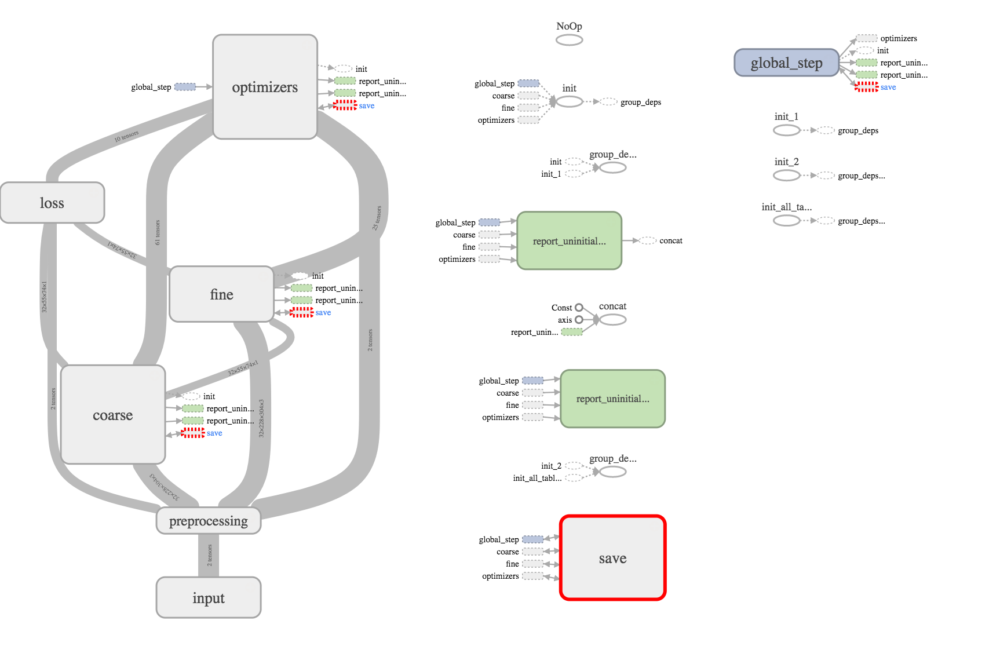

# Introduction

Generating depth maps from single monocular images is still an unsolved
computer vision task. While there were many advances during the last few years,
it is still not possible to achieve depth maps with the same level of detail as
ground truth depth maps using laser scanners or IR sensors allow. Even relative
estimates are difficult to achieve.

At the start of our project we set out to build an artificial neural network (ANN)
which would be capable of identifying depth in video streams, potentially using
information about movements between images to make better estimates than single
images. But over the course of the project it turned out to be hard
enough to reproduce state of the art models for single monocular images, such
that we tuned down our project ideas.

There are two approaches which we decided to tackle: Liu et al.'s Deep
Convolutional Neural Fields (DCNF) [@liu2016] and the slightly earlier paper
about Multi-Scale Deep Networks (MSDN) by Eigen at al. [@eigen2014]
which inspired parts of Liu et al.'s approach. While implementing Liu et al.'s
DCNF, we quickly stumbled over a problem: Many matrices became simply too
big to be computed on a single GPU. Eventually we managed to get it to run by
simplifying the model greatly and using a batch size of only one sample. We
then tried something new: running the model distributed across the
university's on premise data center.

This worked out quite well, but for the DCNF implementation we did not
succeed in getting a better performance as the model itself was not written
well to be run on a distributed system. Since the model is fairly complex, we
figured it would be much easier to try the distributed solution on a simpler
model, so we decided to reimplement Eigen et al.'s MSDN.

In this report we will focus on the challenges we had to overcome to get
TensorFlow, a general computational library specialized for distributed machine
learning applications, and the Sun Grid Engine (SGE), a system to manage
computer clusters and assign computation time to multiple users, to work
together, present some of our solutions and give ideas on how the system and
workflows we came up with could be refined and improved.
First we will introduce the SGE and explain its purpose and give some usage
examples. Then we will quickly explain TensorFlow's approach to machine
learning models and distributed computing. After both frameworks are
introduced, we will explain why it is difficult to run distributed TensorFlow
models on the SGE and how we tackled this problem.
We well then briefly go over the application and discuss our results in
reimplementing Eigen et al.'s MSDN. Eventually we will outline shortcomings of
our approach and ways to potentially solve these problems in future
applications.


# Sun Grid Engine

The institute has a cluster of several hosts that is managed by the Sun Grid
Engine (now known as the Oracle Grid Engine). There is one master/cluster
management server that monitors the current status of all nodes in the grid and
that uses a scheduler to determine on which node and when new jobs should be run.
New jobs can be submitted via a a command line interface (find the whole
reference [here](http://gridscheduler.sourceforge.net/htmlman/htmlman1/qsub.html))
to this scheduler. By specifying resources that are necessary to run this job
(like the minimum of available RAM) the users can ensure that the machine their
job is placed on by the scheduler has the necessary computational resources.
The requested resources are split into two categories: testable and consumable.
Testable are those resources of a machine that have to exist in order to run the
job but are not used up or exhausted by the job itself. An example would be the
speed of the CPU - if a job requires (for whatever reason) a minimum of 4GHz to
be run, it is still possible to have other jobs in parallel that also use the
CPU. The consumable resources now in contrast are used up by the job. Examples
would be the minimum RAM or Cuda cores. These resources are not monitored live
by the scheduler, but are also fixed parameters that have been recorded with the
nodes upon integrating them in the grid. Other use cases include the specific
submission to a host by requiring the hostname or exclusion of hosts. When the
job is scheduled to a node that fulfills all requirements it is executed either
until the job is finished or the walltime is reached whatever happens first.
Another layer of organization are queues. Computational nodes belong to 1 up
to n queues and different users can have differing permissions in respect to
those queues. For example members of the workgroup have extended walltimes
compared to users from different workgroups and so forth. Jobs are per default
committed to a specific queue, but it is also possible to submit to a specific
queue.


# TensorFlow

TensorFlow is an open source software library that abstracts complex
mathematical models and data flows to allow for optimized computation. We used
version 1.3r of the Python API (documentation can be found
[here](https://www.tensorflow.org/api_docs/python/)) to implement the models
presented in the papers. Conceptually TensorFlow requires the user to build a
computational graph - a recipe for the data and the operations applied to it.
The nodes in the graph are either tensors, multi-dimensional arrays that contain
the data, or operations, that compute a function given some input tensors. As
the chain of those operations grows so does the graph that represents the
overall program. Additional mechanisms like scoping helps to reuse computational
building blocks like a convolutional layer again and again and structuring
the graph while constructing it. The final graph can be then executed in a
TensorFlow session to operate on the real input data. TensorFlow then takes care
of computational and hardware based optimizations which resulted for our project
in the usage of the graphics card of the hosts. TensorFlow comes with an
own monitoring tool that allows for visualization of the training process as
well as representations of the graph.


# Distributed computing using the SGE

Sometimes machine learning models are too big for a single processing unit,
even too big for the available random access memory (RAM). To handle such
models, TensorFlow supports the concept of distributed computing. In the
distributed setting, multiple processing units ("workers") process a stream of
data stored on multiple parameter servers ("ps node"). TensorFlow is designed
specifically with the Google Cloud Platform services[^gcp] in mind, a
webservice where one can start up multiple virtual machines as a computing
cluster of nodes. Each of the virtual machines is completely encapsulated,
receives a static IP address and can, e.g. in case of failure, simply be
restarted again with the same settings, the same IP address etc. This approach
has some advantages. It is possible to set up specific machines for specific
tasks, e.g. ps nodes benefit from having high amounts of RAM and CPU power,
while workers can use the power of multiple GPUs efficiently. Additionally
there are tools which handle cluster initializations and take care of keeping
instances alive and restarting them ("reprovisioning") in case of failures.

[^gcp]: https://cloud.google.com/ \linebreak
    There are other cloud services, e.g. Amazon Web Services, Digitial Ocean,
    Microsoft Azure, and more, which support similar approaches to virtualization
    and cluster provisioning. There are also several competitors like Rackspace and
    Oracle, which take a different approach and provide on premise solutions to
    build one's own cloud server infrastructure.

The SGE does not follow these modern principles of distributed
computing using virtualization or clusters to perform large scale computations.
In those settings, one usually can assume nearly unlimited resources and just
specifies what they want for their computations and provision instances
accordingly. The SGE instead allows to distribute resources and
computation fairly among its users. While this is a very efficient and
advantageous method for single process computations, it has some flaws when it
comes to multi process set ups, like the one with multiple workers and ps nodes
we want to build for the distributed computation of TensorFlow models.

To execute a distributed model, TensorFlow processes need to know about the
other devices of the cluster and have to be able to open TCP connections between
them. The information is provided via a cluster specification (`ClusterSpec`),
which can be represented as a simple JSON:

```{ .json }
{"worker": [
    "cippy18.cogsci.uni-osnabrueck.de:5001",
    "cippy19.cogsci.uni-osnabrueck.de:5001",
    "cippy20.cogsci.uni-osnabrueck.de:5001",
    "cippy21.cogsci.uni-osnabrueck.de:5001"
 ],
 "ps": [
    "cippy14.cogsci.uni-osnabrueck.de:5002",
    "cippy16.cogsci.uni-osnabrueck.de:5002",
    "cippy17.cogsci.uni-osnabrueck.de:5002",
    "cippy01.cogsci.uni-osnabrueck.de:5002"
 ]
}
```

Here we use eight different hosts, four as workers and four as ps nodes. In the
following sections we describe how the processes can communicate with each
other, how we generate the cluster specifications automatically, and how we
overcome the problem of walltimes, the time after which the SGE kills a running
process to free resources for other users.


## Routing inside the SGE: Process communication

Assume a simple scenario for a distributed TensorFlow model. We have one worker
and one ps node and want to run both simultaneously on the SGE. After
submitting both tasks, e.g. using a command like

    qsub -N worker -l mem=2G worker.sge && \
        qsub -N ps_node -l mem=16G ps.sge

it will always be uncertain on which host machines they will eventually be
executed. We could make some assumptions about which machines will be available
(maybe the grid only has two hosts and one of them has only 8 GB of memory),
but very often that is not the case. We therefore have no simple way to
communicate between the jobs, unless they perform some lookups. For example,
if submitting the worker first and then the ps node, it is possible to pass the
worker's job ID to the ps node:

    WORKER_JID=$(qsub -N worker -l mem=2G worker.sge | cut -d' ' -f3)
    WORKER_JID=$WORKER_JID qsub -N ps_node -l mem=16G ps.sge

The ps node could now query the job status of the worker (`qstat -j
$WORKER_JID`) and find out the host its running on. The two jobs could now
communicate[^zmqnote].

[^zmqnote]: Assuming there is a way to communicate between the two hosts inside
the network. We were able to simply use some open ports for which TCP and UDP
were enabled for local network traffic. Alternatively we also built a small
solution using a complex network of automatic ssh tunnels between all hosts of
some jobs' "network". As an alternative, our system administrator also
suggested [ZeroMQ](http://zeromq.org), however since we were able to use ports
directly for our TCP connections, we did not try it out.

For multiple hosts this process gets more difficult: Each process needs to know
about all other processes' hosts to be able to build up a `ClusterSpec` and
open up TCP connections between each other. To make this process easier, we
decided to force the computations to be on specific hosts to build the
`ClusterSpec` beforehand, rather than having each job figure out this
information.


## Network architecture and cluster specifications

To efficiently build cluster specifications we divide our grid jobs into a
single master job and several client jobs. The master job, which we will also
call "keepalive", will not perform any computations for the TensorFlow models,
but instead only take care of proper initialization of the client jobs and
restarting them as needed. The client jobs will then either run worker or ps node
processes using a cluster specification provided by the keepalive job.

The keepalive job goes through several steps:

1. Determining the list of available hosts for the requesting user.
2. Creating the `cluster_spec`.
3. Starting the clients.
4. Monitoring the clients.
5. Shutting down the clients.
6. Optionally resubmitting itself.

Step 1 produces a list of hosts which is processed in step 2:

```bash
$ qstat -f -F h -U $(whoami) | python tools/grid/extract_hosts.py
cippy11.cogsci.uni-osnabrueck.de
cippy12.cogsci.uni-osnabrueck.de
cippy13.cogsci.uni-osnabrueck.de
cippy14.cogsci.uni-osnabrueck.de
cippy15.cogsci.uni-osnabrueck.de
```

Step 2 polls the SGE for information about the resources of each of these
hosts:

```changelog
$ qhost -F cuda,cuda_cores -q -h cippy11.cogsci.uni-osnabrueck.de
HOSTNAME                ARCH         NCPU  LOAD  MEMTOT  MEMUSE  SWAPTO  SWAPUS
-------------------------------------------------------------------------------
global                  -               -     -       -       -       -       -
cippy11.cogsci.uni-osnabrueck.de lx26-amd64      4  0.00   31.4G    2.1G   16.0G   58.2M
    Host Resource(s):      hc:cuda=1.000000
   hf:cuda_cores=384.000000
   training.q           BIP   0/0/2
   all.q                BIP   0/0/3
```

The information is parsed and stored. In the example above we have the
following relevant resources: available memory of 31.4 GB RAM, a graphics card
with CUDA support and 384 CUDA cores. Additionally we can see how many slots
are available per queue for this host (for training.q it is `0/0/2`, which
means 0 reserved, 0 in use, 2 available). The Python script `split_resources.py`
uses the information available to distribute the tasks in a greedy fashion among
the available devices. Assuming e.g. four workers and four ps nodes, it would
assign devices with high RAM values as ps nodes and devices with many CUDA
cores to the workers. The resulting cluster specification is stored as a csv
file (which is easier to parse with the keepalive job) and as a JSON (which
maps nicely into Python dictionaries used for the `ClusterSpec` needed by
TensorFlow)[^excs]:

```csv
cippy18.cogsci.uni-osnabrueck.de,5001,worker
cippy19.cogsci.uni-osnabrueck.de,5001,worker
cippy20.cogsci.uni-osnabrueck.de,5001,worker
cippy21.cogsci.uni-osnabrueck.de,5001,worker
cippy14.cogsci.uni-osnabrueck.de,5002,ps
cippy16.cogsci.uni-osnabrueck.de,5002,ps
cippy17.cogsci.uni-osnabrueck.de,5002,ps
cippy01.cogsci.uni-osnabrueck.de,5002,ps
```

[^excs]: An example cluster specification JSON can be found at the beginning of this
  chapter.

The keepalive job parses the information from the stored csv file and submits
client jobs to the specified hosts[^submithost], using some environment variables to specify
the jobs' tasks.

[^submithost]: This is not the usual way to submit jobs, it is more common to
  submit to a specific (or the default queue) and let the SGE scheduler decide
which is the best available host. But since it is (in this approach) very
important to know the addresses of the hosts for the cluster specification, it
works better to submit jobs to hosts. This can be achieved using the
`-l hostname=HOSTNAME` argument for `qsub`.

Each client can, after successful submission, read the JSON file and provide a
`ClusterSpec` for its TensorFlow session. The TensorFlow sessions are
implemented as
[`MonitoredTrainingSession`s](https://www.tensorflow.org/api_docs/python/tf/train/MonitoredTrainingSession).

One big problem with the SGE is that it is not designed for week long training
of ANNs. Since its purpose is to give all users similar computational resources,
every now and then it has to kill certain jobs. This happens when a job exceeds
its walltime. This time can be configured by the SGE administrators and for our
institute it differs depending on the queue one submits their jobs to. For
example, if you would submit to the `training.q` queue, you would get a
walltime of 1.5 hours, while for the `cv.q` queue, which is a queue
specifically for the Computer Vision workgroup we are affiliated with, we would
receive walltimes of 36 hours[^walltime]. While it is possible to resubmit a
job after 36 hours, if can be cumbersome to do this every one and a half.
That is the main purpose for having the keepalive job: While it performs all
initializations and creates the cluster specificationns, it is mostly there to
resubmit jobs before their walltime ends and shut down the old jobs. Its most
important task is to resubmit itself just before it dies, to keep the loop
running.

[^walltime]: There are even finer differences, but the problem is really just
  that we can not just have our jobs running forever and have to watch out for
how long we can run them.

In case of failure of a single task, the keepalive job will not attempt to
restart individual jobs on certain machines but instead just kill all tasks and
resubmit itself, since it is very important to know the hostnames for the
cluster specifications. For this purpose it checks the status of all its jobs
every few seconds.

The clients do not have any specific tasks to perform. They just start their
training scripts with the parameters provided by the keepalive job. However,
those training scripts should somehow be able to handle interruptions and
unexpected shutdowns. The SGE provides a checkpointing mechanism which is
disabled for our institute's cluster, so we resort to the checkpointing
mechanism TensorFlow provides. It stores checkpoints every few minutes
automatically and additionally creates checkpoints on several signals which are
sent to the process, especially `SIGUSR1`, `SIGUSR2`, `SIGTERM`, and `SIGINT`.
The `USR` signals are usually sent by the SGE[^sigs], but our grid
configuration does not send them. Thus we also introduce handling of the alarm
signal, `SIGALRM`, and start a timer which sends this signal after some
specified timeout. This ensures that the job notifies itself shortly before the
walltime is reached. `SIGTERM` and `SIGINT` are mainly handled for debugging
purposes.

[^sigs]: `SIGUSR1` is sent when a user requests job deletion, `SIGUSR2` some
  time before the walltime is reached and the parameter `-notify` is set for
  the grid job. However, once the walltime is reached the jobs receive a
  `SIGKILL`, which can not be handled.


# Results of reimplementing Eigen et al.'s MSDN

@eigen2014 used the NYU dataset [@silberman2012] to train their MSDN (they
also used others, but we decided to just reproduce this particular experiment).

Using some preprocessing scrips we download it, unpack it and create the
`TFRecords`, a data format native for TensorFlow. We then built a TensorFlow
model which reads the data, shuffles it into batches and computes the network.
Due to some limitations of the `MonitoredTrainingSession`[^limitmts] which we were not
aware of in the beginning we were not able to implement a real validation for
the validation set.

[^limitmts]: [TensorFlow GitHub Issue #7951](https://github.com/tensorflow/tensorflow/issues/7951)



The computation graph contains three main parts: The coarse part, the fine part
and the optimizers. Eigen et al. used different optimizers for the coarse and
fine part, so we implemented that as well. As we have some issues with the
`MomentumOptimizer` (`NaN` errors), we use the `AdamOptimizer` and imitate the
momentum without using the momentum changes. We also simplify the problem by
not providing distorted input versions of the dataset.

To test the impact of distributed computing on the training process, we perform
four different experiment setups:

1. One single worker node.
2. One worker node and two ps nodes.
3. Two worker nodes.
4. Four workers nodes and four ps nodes.

Our results turn out to be quite different than Eigen et al.'s: The coarse
layer's output is much less legible and the fine layers don't look similar as
well. We assume that the application of our loss functions might be different
from what they originally did. It seems to be less likely that this is an issue
of lagging gradients, resulting from the distributed computations. Another
problem might be that we are just using the optimizers wrong. Before we
switched to the `AdamOptimizer` we tried it with a less complex structure (one
optimizer only, training the whole network on the loss function applied to the
fine output), and the initial results already looked more like what we would
expect from the outcomes. Unfortunately we did not finish the training and can
not produce any meaningful results.


The bad quality of our results is consistent across all our experiments.
However, computation times differ wildly in each scenario.

Scenario                     Estimated Computation time[^ect] Training loss
---------------------------- -------------------------------- -------------
1. 1 worker                                        9 h 30 min         0.8e4
2. 1 worker, 2 ps nodes[^nd]                  3 d 21 h 30 min         2.6e4
3. 2 workers                                             20 h         1.0e4
4. 4 workers, 4 ps nodes                             4 d 16 h         1.6e4

[^ect]: We can only provide estimated computations times as it is difficult to
  measure the exact times because of the restarts. It is also difficult to
  compare these values, as hosts changed and thus the hardware changed as well.
[^nd]: The training for the scenario 1w/2ps did not properly finish and is an
  intermediate result after ca. 30k steps.

We can conclude that for this particular model, a distributed system is not
beneficial, as the model is small enough to fit on a single GPU and the
resulting overhead for the inter process communications is too much.


# Shortcomings, issues and possible solutions to distributed TensorFlow on the SGE

Despite the achievement of training distributed on the SGE for weeks without
any serious interruptions, there are some flaws in the process which could
still be improved. We see that one should choose wisely whether to distribute
jobs or not (in @eigen2014 there was no benefit in using distributed
execution), but for cases where it makes sense we will offer some ideas for
improvements.


## Configuration improvements

Our approach relies on the fact that some ports in our university network are
open internally and can be used for TCP/UDP communication. For networks where
this is not the case, one could venture into testing ZeroMQ or other
alternatives. However, even our configuration could be improved by making ports
consumable resources. At its current state no two different ps nodes can share
the same host as they would use the same port. If one could check which ports
are taken while submitting jobs, e.g. through a consumable resource, it would
be possible to run multiple ps nodes on the same host. This would make sense
for e.g. hosts with hundreds of gigabytes of RAM where only a few are needed
for a single ps node. It would also be possible to run a worker on a hosts GPU
and a ps node on its CPU very easily.

In some cases the day long training seems not to continue, most likely because
the walltimes are misconfigured for the keepalive jobs -- however, the logs do
not give any hints about this. It is possible that the `SIGALRM` timeouts are
configured too aggressively, this could use further investigation. One of the
biggest problems in our grid is that no notifications (neither `SIGUSR1` nor
`SIGUSR2`) are sent.


## Keepalive script improvements

One major disadvantage of the approach presented in this report is that we
submit jobs to specific hosts rather than specific queues. This can result in
race conditions when other jobs already start on the same host, or result in
suboptimal usage of resources, as currently we just request a fix amount of RAM
rather than just specifying numbers per node type. If one would take
the time and write a keepalive script which just starts any nodes which are
suitable as workers and ps nodes and then report themselves to the keepalive
job, things would get much more flexible. In that case the cluster
specification could be created after the clients started and before each client
starts their training session. This would allow for much greater flexibility
but makes the keepalive code more difficult. For this proof of concept the
current approach seems fine.

Alongside the above mentioned issue of submission to hosts rather than queues
the keepalive script could also handle walltimes better. Currently we just use
a fix timeout for all jobs which is lower than the least available walltime,
but if the keepalive job would figure out the walltimes of each individual job
it could be easier to increase them and thus train longer without
interruptions, reducing the restart overhead.

There is also a rather simple technical issue with many of our keepalive
scripts as they do not always follow the same patterns. Some work as filters
like POSIX programs, taking the output of e.g. `qstat` via the standard input
stream and producing their output into the standard output stream, while others
write or read specific files, or call other programs themselves. It would be
beneficial to have them follow the same structure.


## TensorFlow improvements

For the TensorFlow scripts there are also some ways to improve, some could be
achieved within in the project, others have to be done for the TensorFlow
library itself.

The `ReplicaDeviceSetter`, which takes care of distributing the parameters and
operations across the cluster, currently mostly only works for ps nodes. It is
a non-trivial task to perform operation assignments while creating the graph
and as such one can only resort to manual placement or hope that the option to
co-locate operations with their data works out well. For the DCF [@liu2016]
this might have been very helpful.

One problem also seemed to be that some operations are not distributable as
they are atomic, e.g. the `MatMul` operation can only be performed on one
device. There might be ways on how to distribute them, but we did not manage to
do this. One issue could be that the variable partitioners only work on
specific variables properly, i.e. manually created using `tf.Variable`, and not
properly with variable scopes (`tf.variable_scope`). Similarly the `tf.map_fn`
is difficult to handle and might not always be the best choice, it could be
more beneficial to use slices or replicate parts of the graph during graph
creation, but this is also subject to future investigations.

The last problem is that currently creating an automatic validation on a test
set is really difficult using the standard TensorFlow input pipeline and the
`MonitoredTrainingSession`, as the queues are too inflexible and can not be use
with one shot iterators or similar high level accesses to use them with
regularly performed validation hooks. Luckily the developers of the TensorFlow
library are aware of this problem and propose a fix which can already be tested
in the latest version (1.3), but it still under active development[^limitmts].


# Conclusion

The SGE is not the best choice for distributed computations, but if it is the
only available option, it is still viable and can be tamed to achieve
distributed computing. There are still lots of ways to improve the process and
we look forward to more people setting out to do distributed computations with
TensorFlow on the SGE. This report is merely a try to start the discussion
about distributed training on the SGE.

Despite the success in creating a way of using the SGE to perform distributed
training, we did not achieve the same results in our implementation of the MSDN
as @eigen2014 originally did. We assume that this is just a problem of our
implementation and look forward to test the distributed approach on other
problems, hopefully resulting in better outcomes.


# References
